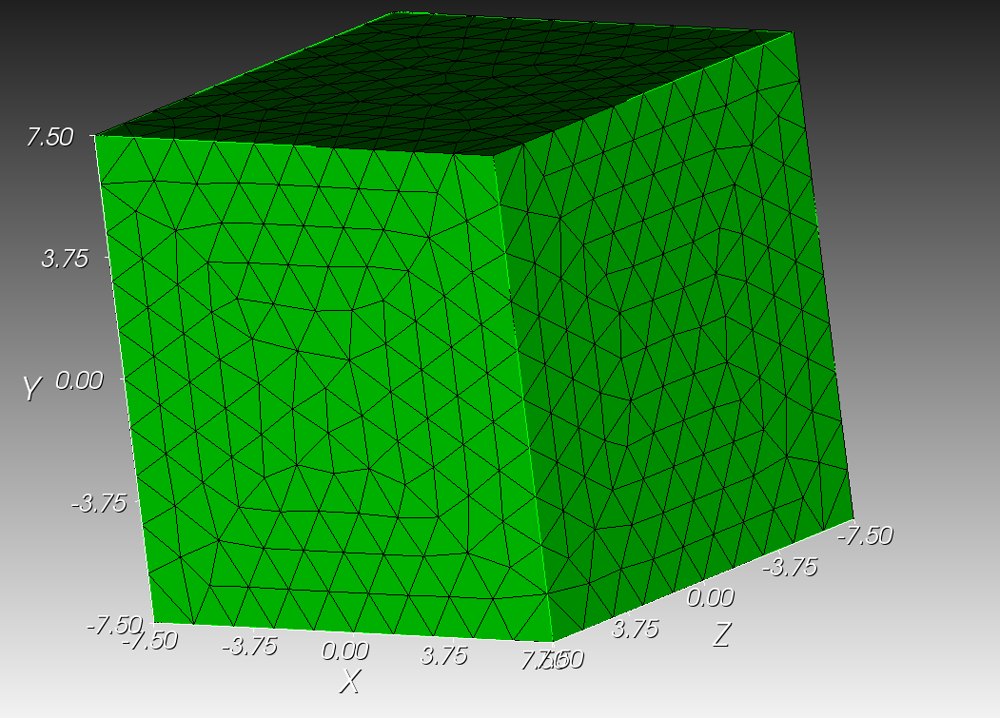

# Manifest

## jezebel.h5m

A simple sphere geometry matching the size of the Jezebel bare sphere core (more info [here](https://www.osti.gov/servlets/purl/1344338)). This file contains a surface mesh only.

| Element Type      | Count |
|-------------------|-------|
| Surface Triangles | 1276  |
| Tetrahedrons      | 10333 |

## jezebel.exo

A simple sphere geometry matching the size of the Jezebel bare sphere core (more info [here](https://www.osti.gov/servlets/purl/1344338)).
This file contains a tetrahedral mesh.

| Element Type      | Count |
|-------------------|-------|
| Surface Triangles | 1276  |
| Tetrahedrons      | 10333 |

## no_overlap.h5m
A simple cube and Cylinder geometry with two volumes that do no overlap.

| Element Type      | Count |
|-------------------|-------|
| Surface Triangles | 1032  |

## no_overlap_imp.h5m
The same as no_overlap.h5m but imprinted?

| Element Type      | Count |
|-------------------|-------|
| Surface Triangles | 1290  |

## overlap.h5m
A simple Cube and Sphere geometry with two volumes that do overlap.

| Element Type      | Count |
|-------------------|-------|
| Surface Triangles | 88220 |

## small_overlap.h5m
A simple Cube and Cylinder geometry with two volumes that overlap over a very small region.

| Element Type      | Count |
|-------------------|-------|
| Surface Triangles | 1032  |

## enclosed.h5m
A simple geometry with two concentric Cylinders - one completely enclosed by the larger one.

| Element Type      | Count |
|-------------------|-------|
| Surface Triangles | 2040  |

## brick.exo
A 10 x 10 x 10 brick centered on the origin. No additional sidesets. (tet mesh)

| Element Type      | Count |
|-------------------|-------|
| Surface Triangles | 1404  |
| Tetrahedrons      | 8790  |

## brick-sidesets.exo
A 10 x 10 x 10 brick centered on the origin. Each surface has a sideset. (tet mesh)

| Element Type      | Count |
|-------------------|-------|
| Surface Triangles | 1404  |
| Tetrahedrons      | 8790  |

## cyl-brick.exo
A 10 x 10 x 10 brick centered on (0, 0, 10) and a cylinder of radius 5 height 10 centered on the origin w/ rotation axis along Z. (tet mesh)

| Element Type      | Count |
|-------------------|-------|
| Surface Triangles | 2692  |
| Tetrahedrons      | 8790  |

## overlap-edge.h5m
A simple edge overlap case consisting of two identical pyramids which have a volume overlap along a triangle edge (no overlapping vertices).

| Element Type      | Count |
|-------------------|-------|
| Surface Triangles | 44    |

  

## beam-overlaps.h5m
A second edge overlap case consisting of two identical beams (cuboids) which have a larger volume overlap (no vertices) along multiple edges.

| Element Type      | Count |
|-------------------|-------|
| Surface Triangles | 136   |

  

# pincell.h5m and pincell-implicit.exo

These two files contain identical meshing in MOAB (`.h5m`) and libMesh (`.exo`)
formats. Metadata is applied in the Cubit model (found in `pincell-both.cub5`)
for both formats as well.

## pincell.h5m

| Element Type      | Count |
|-------------------|-------|
| Surface Triangles | 32544 |

## pincell.exo

| Element Type      | Count |
|-------------------|-------|
| Surface Triangles | 24912 |
| Tetrahedrons      | 93170 |

  
  

In the case of the libMesh model, boundary conditions are only applied to the
outer volume. The interior interfaces of the model are discovered automatically
as implicit boundaries based on the transition between mesh blocks.

# segmented-beam.h5m

A simple rectangular beam segmented into 20 seperate volumes along the x-axis.

| Element Type      | Count |
|-------------------|-------|
| Surface Triangles | 1106  |

  

# cube-mesh-no-geom.exo/h5m/cub5

A simple cube geometry that holds no metadata, only a tet mesh.

  

